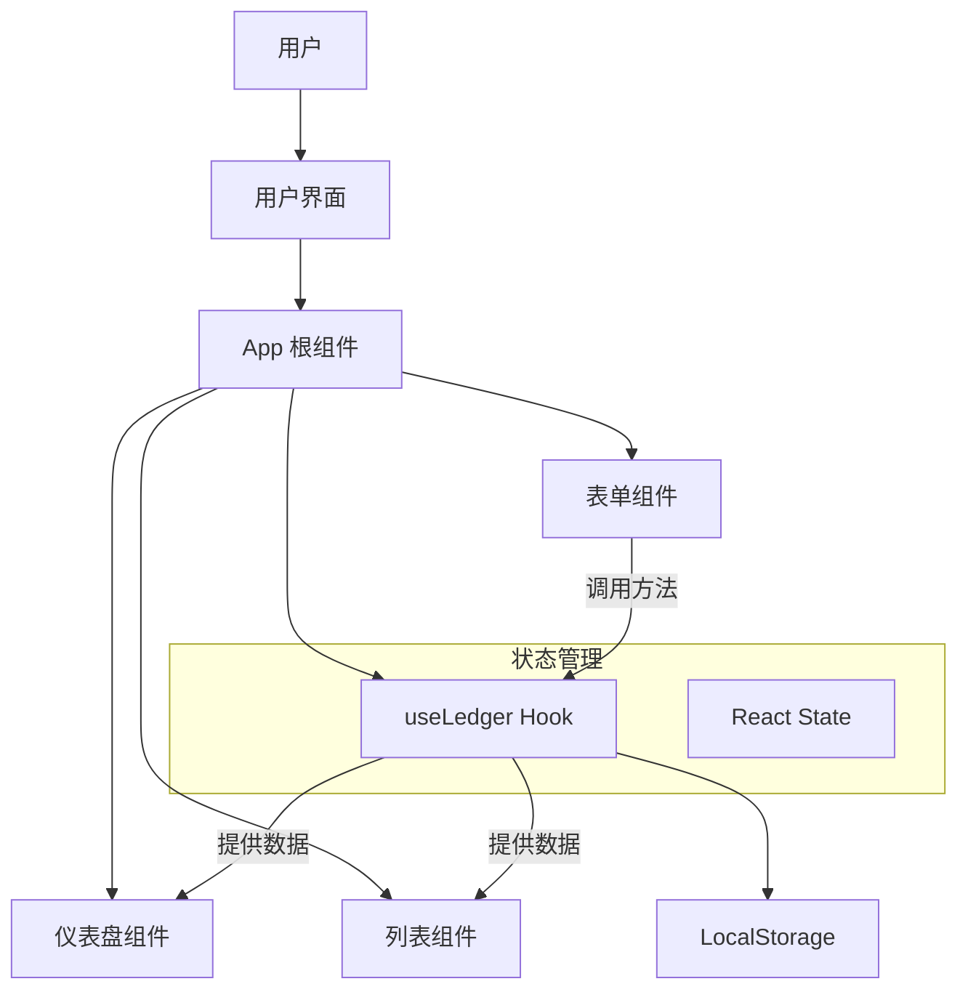

# 小账本 (Pocket Ledger) - 产品报告

## 1. 产品功能介绍
“小账本”是一款专注于移动端体验的极简记账应用。旨在帮助用户快速、便捷地记录日常收支，掌握财务状况。

**核心功能：**
*   **收支记录**：支持收入和支出两种类型的记录，包含金额、分类（如餐饮、交通、工资等）和备注信息。
*   **账户概览**：实时展示总资产、当月收入和当月支出，通过直观的卡片设计让财务状况一目了然。
*   **交易明细**：以列表形式展示最近的交易记录，支持删除误操作的记录。
*   **数据持久化**：所有数据保存在本地浏览器中（LocalStorage），刷新页面不丢失，无需联网注册，保护隐私。

## 2. 程序概要设计
本程序采用单页应用 (SPA) 模式开发，基于 React 框架。

**主要模块：**
*   **App 容器**：负责整体布局、状态提升和路由（虽然目前是单页）。
*   **数据层 (Hook)**：`useLedger` 自定义 Hook 封装了数据的增删改查 (CRUD) 和持久化逻辑。
*   **UI 组件库**：
    *   `Dashboard`：展示统计数据。
    *   `TransactionList`：展示列表。
    *   `AddTransactionForm`：模态窗口表单。

## 3. 软件架构图

## 4. 技术亮点与实现原理
*   **React + Vite 高性能构建**：使用最新的构建工具 Vite，秒级启动，热更新迅速。
*   **CSS 模块化与 TailwindCSS**：利用 TailwindCSS 的原子化类名，实现了高度定制化的 UI 和暗黑模式/响应式布局的基础（本版主要适配移动端）。
*   **自定义 Hook 封装逻辑**：将业务逻辑从视图中分离，`useLedger` 负责所有数据操作，组件只负责渲染，符合“关注点分离”原则。
*   **极致的交互体验**：使用了大量的微交互（如 Hover 效果、点击反馈、磨砂玻璃效果 `backdrop-blur`），提升了使用的愉悦感。
